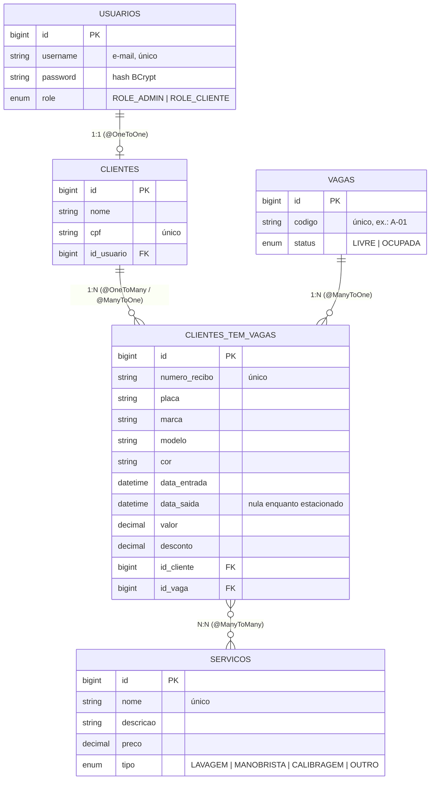

# Estacionamento-API

API REST para gestão de um estacionamento de veículos: cadastro de usuários e clientes, controle de vagas, serviços extras (lavagem, manobrista...) e registro de entrada (check-in) e saída (check-out) dos veículos, com cálculo automático do valor a pagar.

Projeto final da disciplina, desenvolvido com Spring Boot seguindo os requisitos técnicos da Parte 1: entidades relacionadas, CRUD completo, paginação, consultas personalizadas, documentação OpenAPI e HATEOAS.

## Tecnologias

| Tecnologia | Uso |
|---|---|
| Java 17 | Linguagem |
| Spring Boot 4.1 | Framework base (Web MVC, Validation, Security) |
| Spring Data JPA + Hibernate | Persistência (ORM) |
| H2 Database | Banco de dados em arquivo (`./data/estacionamento`) |
| Spring HATEOAS | Links hipermídia nas respostas (formato HAL) |
| Springdoc OpenAPI 3 / Swagger UI | Documentação interativa |
| JJWT 0.13 | Autenticação por token JWT |
| ModelMapper + Lombok | Conversão entidade ↔ DTO e redução de código repetitivo |
| JUnit 5 + RestTestClient | Testes de integração ponta a ponta |
| Maven (wrapper incluso) | Build e dependências |

## Como executar

**Pré-requisito:** JDK 17 ou superior. Não é preciso instalar o Maven, porque o projeto usa o Maven Wrapper.

```bash
git clone https://github.com/fidelisspp/Estacionamento-API.git
cd Estacionamento-API
./mvnw spring-boot:run        # no Windows (cmd/PowerShell): mvnw.cmd spring-boot:run
```

A API sobe em `http://localhost:8080`. As tabelas são criadas automaticamente na primeira execução.

| Recurso | Endereço |
|---|---|
| Swagger UI (documentação interativa) | http://localhost:8080/docs-park.html |
| Especificação OpenAPI (JSON) | http://localhost:8080/docs-park |
| Console do H2 | http://localhost:8080/h2-console — JDBC URL `jdbc:h2:file:./data/estacionamento`, usuário `sa`, senha em branco |

## Primeiros passos (autenticação)

A API usa **JWT**. Só o cadastro de usuário (`POST /api/v1/usuarios`), o login (`POST /api/v1/auth`), a documentação e o console H2 são públicos; todo o resto exige o cabeçalho `Authorization: Bearer <token>`.

Existem dois perfis:
- **CLIENTE**: perfil de quem se cadastra pela API. Gerencia o próprio cadastro e consulta os próprios estacionamentos.
- **ADMIN**: o atendente do estacionamento. Gerencia vagas, serviços e clientes, e faz check-in e check-out.

**1. Criar um usuário** (nasce sempre como CLIENTE):
```http
POST /api/v1/usuarios
{ "username": "ana@email.com", "password": "123456" }
```

**2. Promover a ADMIN (primeira vez).** Não existe usuário administrador pré-cadastrado. No console do H2, execute:
```sql
UPDATE USUARIOS SET ROLE = 'ROLE_ADMIN' WHERE USERNAME = 'ana@email.com';
```

**3. Fazer login e copiar o token:**
```http
POST /api/v1/auth
{ "username": "ana@email.com", "password": "123456" }
→ { "token": "eyJhbGciOiJIUzI1NiJ9..." }
```

No Swagger, clique em **Authorize**, cole o token e todas as requisições passam a enviá-lo.

> O token expira em **2 minutos** (configuração em `JwtUtils.EXPIRE_MINUTES`). Ao receber `401`, faça login de novo.

## Modelo de dados



| Entidade | Tabela | Descrição |
|---|---|---|
| `Usuario` | `usuarios` | Conta de acesso (login, senha e perfil). |
| `Cliente` | `clientes` | Dados pessoais (nome e CPF), ligados a um usuário. |
| `Vaga` | `vagas` | Vaga física do estacionamento. |
| `ClienteVaga` | `clientes_tem_vagas` | Um estacionamento: o veículo de um cliente numa vaga, do check-in ao check-out. |
| `Servico` | `servicos` | Serviço extra que pode ser contratado no check-in. |

Todas as entidades usam **Bean Validation** (`@NotBlank`, `@Size`, `@CPF`, `@Positive`...) e têm campos de **auditoria** (data e autor da criação e da última alteração), preenchidos automaticamente.

## Regras de negócio

**Cobrança no check-out:**

| Tempo de permanência | Valor |
|---|---|
| Até 15 minutos | R$ 5,00 |
| Até 60 minutos | R$ 9,25 |
| Acima de 60 minutos | R$ 9,25 + R$ 1,75 a cada 15 minutos adicionais |

- O preço dos serviços extras contratados é somado ao valor do tempo.
- A cada **10 estacionamentos concluídos**, o cliente ganha **30% de desconto**.
- O check-in ocupa automaticamente a primeira vaga livre, e o check-out a libera.

**Proteções de integridade** (respondem `409 Conflict`):
- Uma vaga com veículo estacionado não pode ser alterada. Uma vaga já usada em um estacionamento não pode ser excluída.
- Um serviço já usado em um estacionamento não pode ser excluído.
- Um cliente com histórico de estacionamentos não pode ser excluído.
- Um usuário com cadastro de cliente não pode ser excluído, e o ADMIN não pode excluir a própria conta.
- Só estacionamentos **finalizados** podem ser excluídos.

## Endpoints

Todas as rotas começam com `/api/v1`. As listagens são paginadas com `?page=0&size=20&sort=campo,asc`.

### Usuários — `/usuarios`
| Método | Rota | Descrição | Acesso |
|---|---|---|---|
| POST | `/usuarios` | Cria um usuário (perfil CLIENTE) | Público |
| GET | `/usuarios/{id}` | Busca um usuário | ADMIN ou o próprio usuário |
| PATCH | `/usuarios/{id}` | Altera a própria senha | O próprio usuário |
| GET | `/usuarios` | Lista os usuários (paginado) | ADMIN |
| GET | `/usuarios/role/{role}` | **Consulta personalizada:** lista por perfil (`ADMIN` ou `CLIENTE`) | ADMIN |
| DELETE | `/usuarios/{id}` | Exclui um usuário | ADMIN |

### Autenticação — `/auth`
| Método | Rota | Descrição | Acesso |
|---|---|---|---|
| POST | `/auth` | Faz login e devolve o token JWT | Público |

### Clientes — `/clientes`
| Método | Rota | Descrição | Acesso |
|---|---|---|---|
| POST | `/clientes` | Cadastra o cliente do usuário logado | CLIENTE |
| GET | `/clientes/{id}` | Busca um cliente | ADMIN |
| GET | `/clientes` | Lista os clientes (paginado) | ADMIN |
| GET | `/clientes/detalhes` | Dados do cliente logado | CLIENTE |
| GET | `/clientes/cpf/{cpf}` | **Consulta personalizada:** busca pelo CPF | ADMIN |
| PUT | `/clientes/{id}` | Atualiza nome e CPF | ADMIN |
| DELETE | `/clientes/{id}` | Exclui um cliente sem histórico | ADMIN |

### Vagas — `/vagas`
| Método | Rota | Descrição | Acesso |
|---|---|---|---|
| POST | `/vagas` | Cria uma vaga | ADMIN |
| GET | `/vagas/{codigo}` | Busca uma vaga pelo código | ADMIN |
| GET | `/vagas` | Lista as vagas (paginado) | ADMIN |
| GET | `/vagas/status/{status}` | **Consulta personalizada:** lista por status (`LIVRE` ou `OCUPADA`) | ADMIN |
| PUT | `/vagas/{codigo}` | Atualiza código e status | ADMIN |
| DELETE | `/vagas/{codigo}` | Exclui uma vaga nunca usada | ADMIN |

### Serviços — `/servicos`
| Método | Rota | Descrição | Acesso |
|---|---|---|---|
| POST | `/servicos` | Cria um serviço extra | ADMIN |
| GET | `/servicos/{id}` | Busca um serviço | ADMIN, CLIENTE |
| GET | `/servicos` | Lista os serviços (paginado) | ADMIN, CLIENTE |
| GET | `/servicos/tipo/{tipo}` | **Consulta personalizada:** lista por tipo | ADMIN, CLIENTE |
| PUT | `/servicos/{id}` | Atualiza um serviço | ADMIN |
| DELETE | `/servicos/{id}` | Exclui um serviço nunca usado | ADMIN |

### Estacionamentos — `/estacionamentos`
| Método | Rota | Descrição | Acesso |
|---|---|---|---|
| POST | `/estacionamentos/check-in` | Entrada do veículo (com serviços extras opcionais) | ADMIN |
| GET | `/estacionamentos/{recibo}` | Busca um estacionamento (em aberto ou finalizado) | ADMIN ou o dono do recibo |
| GET | `/estacionamentos/check-in/{recibo}` | Busca um check-in em aberto | ADMIN ou o dono do recibo |
| PUT | `/estacionamentos/check-out/{recibo}` | Saída do veículo e cálculo do valor | ADMIN |
| GET | `/estacionamentos/cpf/{cpf}` | **Consulta personalizada:** histórico de um cliente pelo CPF | ADMIN |
| GET | `/estacionamentos` | Histórico do cliente logado | CLIENTE |
| DELETE | `/estacionamentos/{recibo}` | Exclui um estacionamento finalizado | ADMIN |

**Códigos de status usados:** `200` OK · `201` Created (com cabeçalho `Location`) · `204` No Content · `400` parâmetro inválido · `401` sem token ou token expirado · `403` sem permissão · `404` não encontrado · `409` conflito com regra de negócio · `422` dados de entrada inválidos.

## HATEOAS

As respostas seguem o formato **HAL**: cada recurso traz um bloco `_links` com as ações possíveis, e as listagens trazem `_embedded`, `_links` (`first`, `prev`, `next`, `last`) e `page`.

Os links são **condicionais**: cada resposta só mostra as ações que quem consulta consegue executar naquele momento. Exemplo de um estacionamento em aberto, visto pelo ADMIN:

```json
{
  "placa": "ABC-1234",
  "recibo": "20261003-143512",
  "dataEntrada": "2026-10-03 14:35:12",
  "vagaCodigo": "A-01",
  "_links": {
    "self":            { "href": "http://localhost:8080/api/v1/estacionamentos/20261003-143512" },
    "check-out":       { "href": "http://localhost:8080/api/v1/estacionamentos/check-out/20261003-143512" },
    "cliente":         { "href": "http://localhost:8080/api/v1/clientes/cpf/79074426050" },
    "vaga":            { "href": "http://localhost:8080/api/v1/vagas/A-01" },
    "estacionamentos": { "href": "http://localhost:8080/api/v1/estacionamentos/cpf/79074426050{?page,size,sort}", "templated": true }
  }
}
```

- **Pelo estado:** depois do check-out, o link `check-out` some e aparece o `delete`.
- **Pelo perfil:** o CLIENTE não recebe links de ações de ADMIN (`check-out`, `delete`, `vaga`), que responderiam `403`.
- **Navegação entre recursos:** do estacionamento para o cliente e a vaga, e do cliente para o histórico de estacionamentos.

## Testes

O projeto tem **107 testes de integração** que sobem a aplicação e fazem requisições HTTP reais, cobrindo os casos de sucesso, os erros de validação, as permissões e os links HATEOAS de todos os recursos.

```bash
./mvnw test -Dtest='*IT'
```

> As classes de teste terminam em `IT`, e por isso o `./mvnw test` sem o filtro não as executa.

## Estrutura do projeto

```
src/main/java/com/joaovitor/estacionamento_api
├── config/            Segurança (Spring Security), OpenAPI e fuso horário
├── entity/            Entidades JPA
├── exception/         Exceções de regra de negócio
├── jwt/               Geração e validação do token JWT
├── repository/        Repositórios Spring Data (+ projections)
├── service/           Regras de negócio
├── util/              Cálculo de valores e geração de recibo
└── web/
    ├── controller/    Endpoints REST (HATEOAS + documentação)
    ├── dto/           Objetos de entrada e saída (+ mappers)
    └── exception/     Tratamento global de erros (ErrorMessage)
```
